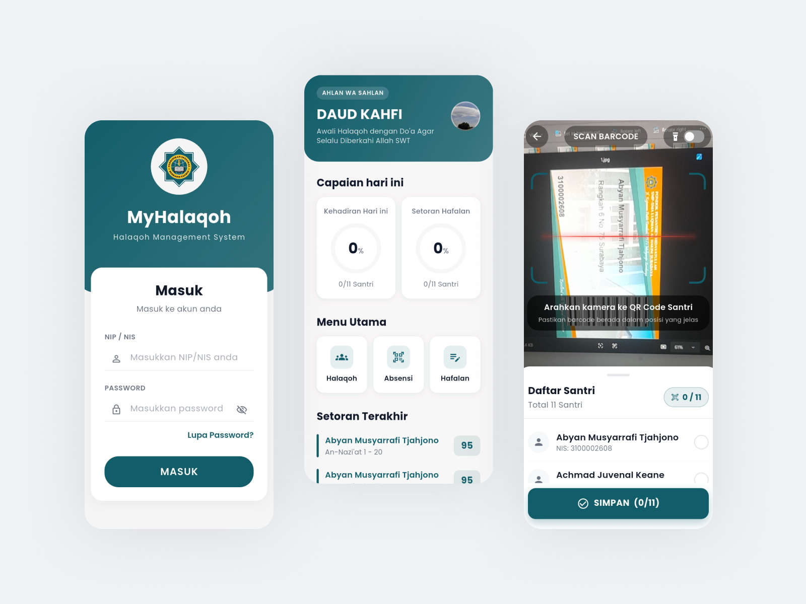
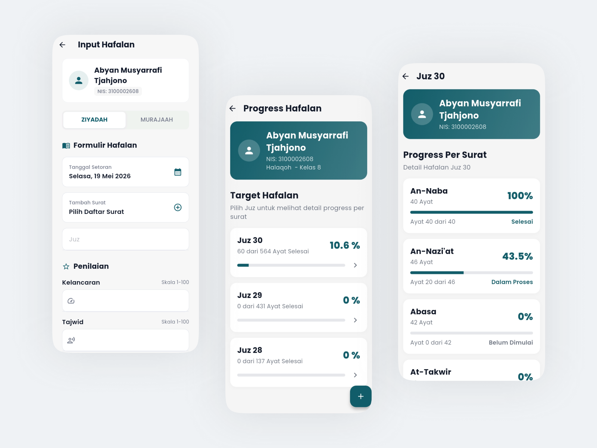
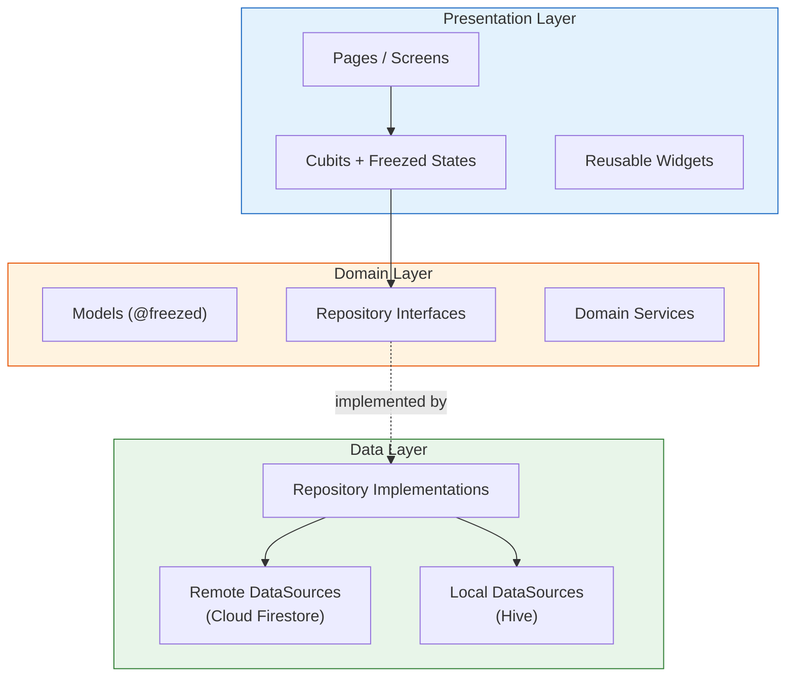
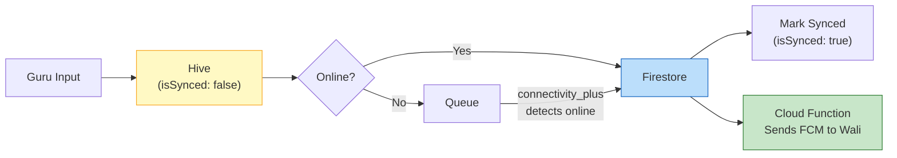

<div align="center">


# MyHalaqoh

**Digital backbone for Qur'an memorization tracking & halaqoh attendance management in pesantren.**

[](https://flutter.dev)
[](https://dart.dev)
[](https://firebase.google.com)
[](.)
[](.)

---

[Features](#features) · [Screenshots](#screenshots) · [Architecture](#architecture) · [Tech Stack](#tech-stack) · [Project Structure](#project-structure) · [Roles & Permissions](#roles--permissions)

</div>

---

## About

Many pesantren (Islamic boarding schools) in Indonesia still rely on paper-based systems for daily operations — recording Qur'an memorization progress on handwritten cards, tracking attendance in physical logbooks, and communicating student progress to parents through informal channels. This manual approach is error-prone, hard to aggregate, and offers no real-time visibility.

**MyHalaqoh** is a mobile application designed to digitize and streamline halaqoh (Qur'an study circle) management. It provides role-based dashboards for administrators, teachers (guru), and parents/guardians (wali santri), enabling efficient attendance recording, hafalan (memorization) tracking with per-surah and per-juz analytics, and automated push notifications to keep parents informed.

MyHalaqoh employs an offline-first architecture — teachers can record attendance and hafalan submissions without internet connectivity, with automatic synchronization when a connection is restored. The app includes a complete Qur'an metadata dataset (114 surahs) for accurate memorization tracking, multi-session attendance with barcode scanning support, and exportable PDF/CSV reports.

---

## Features

### Super Admin
- **Role Impersonation** — Switch perspective to admin or guru for testing and support
- **Activity Log** — Full audit trail of all CRUD operations across the system
- **Full System Access** — Unrestricted read/write to all collections and modules

### Admin
- **Guru Management** — CRUD operations for teacher profiles with NIP and program assignment
- **Santri Management** — Student registration with class (kelas), program, and wali santri data
- **Halaqoh Management** — Create and manage study circles, assign guru and santri
- **Target Hafalan Configuration** — Define memorization targets per class and program with SPI (semester-based progress indicators)
- **Kelas & Program Management** — Configure class levels and program types (Reguler / Takhassus)
- **User Account Management** — Create, bulk-create, reset passwords, and delete user accounts via Cloud Functions
- **Master Data Settings** — Centralized configuration for all institutional data

### Guru
- **Attendance Recording** — Multi-session (Shubuh, Dhuha, Siang, Ashar, Maghrib) attendance with barcode scanning and manual entry
- **Hafalan Input** — Record Qur'an memorization submissions with surah, ayah range, juz, and quality ratings (kelancaran & tajwid)
- **Hafalan Progress Analytics** — View per-juz and per-surah progress for each santri, with mutaba'ah (monitoring) dashboards
- **Attendance History & Calendar** — Browse historical attendance records with calendar view
- **Reporting** — Generate attendance and hafalan reports, exportable as PDF
- **Offline-First** — Record attendance and hafalan without internet; auto-syncs when online
- **Profile Management** — Edit personal profile, change password

### Wali Santri
- **Dashboard** — Overview of child's attendance and hafalan status
- **Hafalan Progress** — View memorization history, per-juz and per-surah progress, and mutaba'ah
- **Attendance History** — Browse attendance records and calendar view
- **Push Notifications** — Automatic FCM notifications when attendance is recorded or hafalan is submitted
- **Profile Management** — Edit profile and change password

### Cross-Cutting Features
- **Dark Mode** — Full light/dark/system theme support
- **Bilingual** — Indonesian (default) and English, powered by type-safe `slang` i18n
- **Offline-First Sync** — Hive local cache with automatic Firestore synchronization
- **Responsive Design** — Adaptive layout via `flutter_screenutil` (360×690 design base)
- **Role-Based Access Control** — Route guards enforcing permissions per role

---

## Screenshots
 

 

 
---

## Architecture

MyHalaqoh follows **Clean Architecture** principles with three distinct layers per feature module, enforced through a consistent folder structure:



### Offline-First Sync Flow

Attendance and hafalan data follow an offline-first write strategy:



**Key sync details:**
- **Write path:** Save to Hive first (instant) → async push to Firestore
- **Read path:** Stream from Hive local box; Firestore only accessed for initial seed (`seedFromRemoteIfEmpty`)
- **Sync trigger:** `connectivity_plus` stream listener auto-syncs when connection is restored
- **ID strategy:** Deterministic client-side keys (e.g., `{halaqohId}_{timestampMs}_{sesi}`) — stable across offline/online transitions
- **Conflict resolution:** Unsynced records are pushed one-by-one; failures are logged and skipped

---

## Tech Stack

### Framework & Language

| Package | Version | Purpose |
|---------|---------|---------|
| Flutter | 3.35.4 | Cross-platform UI framework |
| Dart | ^3.9.2 | Programming language |

### State Management & DI

| Package | Version | Purpose |
|---------|---------|---------|
| `flutter_bloc` | ^9.1.1 | Cubit/BLoC state management |
| `bloc` | ^9.0.0 | Core BLoC library |
| `freezed_annotation` | ^3.1.0 | Immutable state classes with code generation |
| `equatable` | ^2.0.7 | Value equality for state comparison |
| `get_it` | ^8.2.0 | Service locator for dependency injection |
| `dartz` | ^0.10.1 | Functional programming (Either type for error handling) |

### Backend & Database

| Package | Version | Purpose |
|---------|---------|---------|
| `firebase_core` | ^4.6.0 | Firebase initialization |
| `cloud_firestore` | ^6.2.0 | Cloud database (remote storage) |
| `firebase_auth` | ^6.3.0 | Authentication (identifier-based email/password) |
| `firebase_storage` | ^13.2.0 | File storage (profile photos) |
| `firebase_messaging` | ^16.1.3 | FCM push notifications |
| `firebase_app_check` | ^0.4.2 | App integrity verification |
| `cloud_functions` | ^6.1.0 | Server-side logic invocation |

### Local Storage & Offline

| Package | Version | Purpose |
|---------|---------|---------|
| `hive` | ^2.2.3 | Local NoSQL database (8 TypeAdapters) |
| `hive_flutter` | ^1.1.0 | Hive Flutter integration |
| `shared_preferences` | ^2.5.4 | Key-value storage (theme, locale prefs) |
| `connectivity_plus` | ^7.1.1 | Network state monitoring for auto-sync |

### Routing & Navigation

| Package | Version | Purpose |
|---------|---------|---------|
| `auto_route` | ^10.1.2 | Declarative routing with code generation |

### UI & Design

| Package | Version | Purpose |
|---------|---------|---------|
| `flutter_screenutil` | ^5.9.3 | Responsive sizing (360×690 design base) |
| `google_fonts` | ^6.3.2 | Typography (Poppins — bundled as primary font) |
| `shimmer_animation` | ^2.2.1 | Loading skeleton animations |
| `animated_notch_bottom_bar` | ^1.0.3 | Animated bottom navigation bar |
| `animated_custom_dropdown` | 3.1.1 | Custom dropdown widgets |
| `percent_indicator` | ^4.2.5 | Circular/linear progress indicators |
| `mobile_scanner` | ^7.1.2 | QR/barcode scanning for attendance |
| `image_picker` | ^1.1.2 | Camera/gallery image selection |

### Internationalization

| Package | Version | Purpose |
|---------|---------|---------|
| `slang` | ^4.8.1 | Type-safe i18n with code generation |
| `slang_flutter` | ^4.8.0 | Flutter bindings for slang |
| `intl` | ^0.20.2 | Date/number formatting |

### Reporting & Export

| Package | Version | Purpose |
|---------|---------|---------|
| `pdf` | ^3.11.3 | PDF document generation |
| `printing` | ^5.14.2 | PDF preview and printing |
| `csv` | ^6.0.0 | CSV file generation |
| `share_plus` | ^12.0.0 | Native share dialog |
| `file_picker` | ^8.1.2 | File selection (bulk import) |

### Notifications

| Package | Version | Purpose |
|---------|---------|---------|
| `flutter_local_notifications` | ^18.0.1 | Local notification display |
| `firebase_messaging` | ^16.1.3 | FCM push notifications |

### Dev Tools & Code Generation

| Package | Version | Purpose |
|---------|---------|---------|
| `build_runner` | ^2.7.1 | Code generation orchestrator |
| `freezed` | ^3.2.3 | Immutable class code generation |
| `json_serializable` | ^6.11.1 | JSON serialization code generation |
| `auto_route_generator` | ^10.2.4 | Route code generation |
| `slang_build_runner` | ^4.8.1 | i18n code generation |
| `flutter_gen_runner` | ^5.12.0 | Asset code generation |
| `flutter_launcher_icons` | ^0.14.3 | App icon generation |
| `flutter_native_splash` | ^2.4.5 | Native splash screen generation |
| `mocktail` | ^1.0.4 | Mock library for testing |
| `flutter_lints` | ^6.0.0 | Lint rules |

### Cloud Functions (TypeScript)

| Package | Version | Runtime |
|---------|---------|---------|
| `firebase-functions` | ^7.2.5 | Node.js 20 |
| `firebase-admin` | ^13.9.0 | Server-side Firebase SDK |
| TypeScript | ^6.0.0 | Language |

---

## Project Structure

```
lib/
├── firebase_options.dart              # FlutterFire config (Android + iOS)
├── main.dart                          # App entry point, initialization sequence
├── gen/                               # Generated assets & i18n
└── src/
    ├── core/
    │   ├── dictionaries/i18n/         # Localization (id.i18n.json, en.i18n.json)
    │   ├── enums/                     # AttendanceStatus, HafalanJenis, UserRole
    │   ├── helpers/                   # Active session helper
    │   ├── locale/                    # LocaleCubit + LocaleRepository
    │   ├── notifications/             # Notification tap handler
    │   ├── quran/                     # QuranService, SurahModel, JuzModel
    │   ├── router/                    # AppRouter (auto_route) + AuthGuard, RoleGuard
    │   ├── service_locator/           # GetIt DI registration (~80+ bindings)
    │   ├── services/                  # ActivityLogService, StorageService
    │   ├── theme/                     # AppTheme (light/dark), ThemeCubit
    │   └── widget/                    # Shared widgets (buttons, dialogs, shimmers)
    └── modules/
        ├── about/                     # About page
        ├── auth/                      # Login, splash, AuthCubit
        ├── guru_absensi/              # Attendance recording (offline-first)
        ├── guru_dashboard/            # Guru home + summary stats
        ├── guru_hafalan/              # Hafalan input, history, progress (offline-first)
        ├── guru_halaqoh/              # Guru's halaqoh list & detail
        ├── guru_laporan/              # PDF/reporting (attendance & hafalan)
        ├── guru_profile/              # Guru profile management
        ├── master_data/               # Guru, Santri, Halaqoh, Kelas, Program, TargetHafalan CRUD
        ├── notifications/             # FCM token management
        ├── super_admin/               # Impersonation, activity log
        ├── wali_santri_absensi/       # Parent's attendance view
        ├── wali_santri_dashboard/     # Parent's home dashboard
        ├── wali_santri_hafalan/       # Parent's hafalan progress view
        └── wali_santri_profile/       # Parent's profile management

functions/src/                         # Cloud Functions (TypeScript)
├── index.ts                           # Exports all functions (region: asia-southeast2)
├── createUserAccount.ts               # Create Auth + Firestore user atomically
├── bulkCreateUserAccounts.ts          # Bulk user creation
├── deleteUserAccount.ts               # Cascade delete on doc removal
├── resetUserPassword.ts               # Admin-triggered password reset
├── adminSeeder.ts                     # Initial admin seed (delete after use!)
├── sendAbsensiNotification.ts         # FCM to wali on attendance write
└── sendHafalanNotification.ts         # FCM to wali on hafalan write
```

Each feature module follows a consistent structure:

```
module_name/
├── data/
│   ├── datasources/
│   │   ├── local/          # Hive-based local storage
│   │   └── remote/
│   │       └── source/
│   │           ├── *_remote_data_source.dart       # Interface
│   │           └── implementation/
│   │               └── *_remote_data_source_impl.dart
│   └── repositories/
│       └── *_repository_impl.dart
├── domain/
│   ├── models/             # @freezed data classes
│   ├── repositories/       # Abstract repository interfaces
│   └── services/           # Domain services (e.g., sync)
└── presentation/
    ├── cubits/             # Cubit + @freezed state
    ├── pages/              # Screen widgets
    └── widgets/            # Module-specific widgets
```

---

## Roles & Permissions

| Role | Access | Key Screens |
|------|--------|-------------|
| **Super Admin** | Full read/write to all data. Can impersonate admin or guru. Views activity log. | SuperAdminPicker, ActivityLog, ActivityLogDetail |
| **Admin** | Manages all master data (guru, santri, halaqoh, kelas, program, target hafalan). Creates/deletes user accounts via Cloud Functions. | Dashboard, GuruList, SantriList, HalaqohList, TargetHafalanList, KelasProgram, Settings |
| **Guru** | Records attendance (multi-session, barcode + manual). Records hafalan submissions. Views progress analytics. Generates PDF reports. Manages own profile. | GuruDashboard, Attendance, Hafalan (Input/Riwayat/Progress/Mutabaah), Laporan, Profile |
| **Wali Santri** | Read-only access to linked child's attendance and hafalan data. Receives push notifications. Manages own profile. | WaliDashboard, RiwayatHafalan, ProgressPerJuz/PerSurah, Mutabaah, RiwayatAbsensi, Profile |

**Authentication model:** Identifier-based (e.g., `{nip}@myhalaqoh.app` for guru, `{nis}@myhalaqoh.app` for santri). User accounts are created server-side via Cloud Functions — there is no self-registration.

**Firestore Security Rules** enforce role-based access with helper functions (`isAdmin()`, `isSuperAdmin()`, `isAdminOrSuperAdmin()`), including self-update permissions for guru/santri profiles and FCM token updates.
